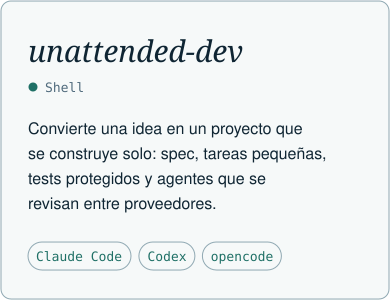
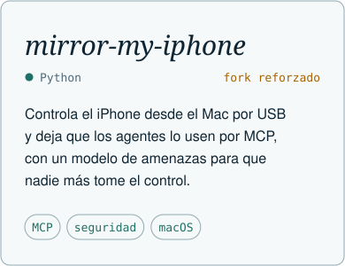
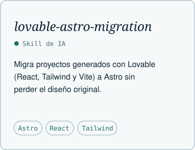
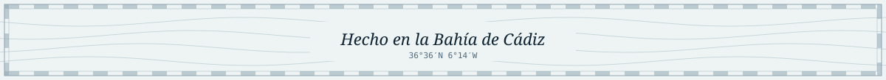

<picture>
  <source media="(prefers-color-scheme: dark)" srcset="assets/hero-dark.svg">
  
</picture>

  
  
  

Construyo aplicaciones que usan LLMs para hacer trabajo real: agentes que se reparten tareas, extracción de datos con citas que se comprueban y decisiones que toma el código, no el modelo. Soy Técnico Superior en DAW (2025), hice un bootcamp full stack y busco mi primer puesto en plantilla en España.

Antes de programar trabajé en ventas, atención al cliente y soporte técnico, y con Atlante Studio hago webs para negocios de la Bahía de Cádiz. Por eso empiezo siempre por entender a quien va a usar lo que construyo.

## Ahora mismo

<picture>
  <source media="(prefers-color-scheme: dark)" srcset="assets/encaje-dark.svg">
  
</picture>

Encaje es la herramienta con la que busco trabajo y, a la vez, mi proyecto principal: Python, FastAPI y SQLite, evaluada contra un conjunto de ofertas etiquetadas a mano y comparada con un filtro de palabras clave. El repo será público al cerrar el primer hito.

## Proyectos

  <a href="https://github.com/Aresdgi/unattended-dev"><picture>
    <source media="(prefers-color-scheme: dark)" srcset="assets/card-unattended-dev-dark.svg">
    
  </picture></a>
  <a href="https://github.com/Aresdgi/mirror-my-iphone"><picture>
    <source media="(prefers-color-scheme: dark)" srcset="assets/card-mirror-my-iphone-dark.svg">
    
  </picture></a>
  <a href="https://github.com/Aresdgi/lovable-astro-migration"><picture>
    <source media="(prefers-color-scheme: dark)" srcset="assets/card-lovable-astro-migration-dark.svg">
    
  </picture></a>

## Cómo trabajo

- **Spec primero.** Especificación, tareas pequeñas con criterio de aceptación y tests antes que código.
- **Agentes con control.** Orquesto Claude Code, Codex y opencode con revisión cruzada entre proveedores. El modelo nunca decide solo lo que se puede comprobar con código.
- **Medir antes de complicar.** Una pieza nueva entra si mejora una métrica.

## Tecnologías

**Agentes e IA**

  
  
  
  

**Día a día**

**Aprendiendo**

**También he trabajado con**

## Actividad

<picture>
  <source media="(prefers-color-scheme: dark)" srcset="https://raw.githubusercontent.com/Aresdgi/Aresdgi/output/snake-dark.svg">
  
</picture>

<b>English</b>

 

I build applications that use LLMs to do real work: agents that split tasks between them, data extraction with citations that get checked, and decisions made by code, not by the model. Higher Technician in Web Application Development (DAW, Spain, 2025) and full stack bootcamp, based in El Puerto de Santa María (Cádiz, Spain). Looking for my first in-house role in Spain, on-site or hybrid in Andalusia, or remote.

Before coding I worked in sales, customer service and technical support, and through Atlante Studio I build websites for local businesses.

- **Encaje** (in progress): the tool I use to find a job. It fetches offers, extracts requirements with an LLM, decides in code whether they fit my profile and drafts applications where every claim is backed by a real fact. Python, FastAPI and SQLite, evaluated against a hand-labeled set of offers.
- [**unattended-dev**](https://github.com/Aresdgi/unattended-dev): turns an idea into a self-building project with small tasks, protected tests and cross-provider agent QA.
- [**mirror-my-iphone**](https://github.com/Aresdgi/mirror-my-iphone): security-hardened fork to control an iPhone from a Mac and let AI agents use it via MCP.
- [**lovable-astro-migration**](https://github.com/Aresdgi/lovable-astro-migration): AI skill to migrate Lovable projects to Astro without losing the design.

<picture>
  <source media="(prefers-color-scheme: dark)" srcset="assets/footer-dark.svg">
  
</picture>
